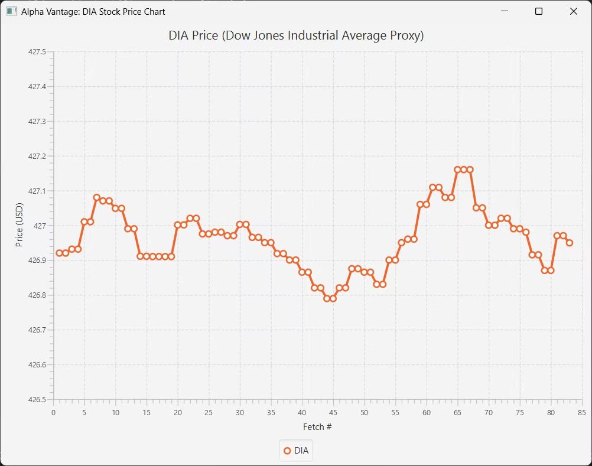

# Alpha Vantage DIA Price Tracker

A JavaFX application that fetches and displays the latest DIA ETF (Dow Jones Industrial Average proxy) price using the 15-minute delayed Alpha Vantage API. The application retrieves data every 5 seconds and dynamically updates a line chart with the latest price information. 
Project summary: https://www.linkedin.com/in/mj-yuan-786678324/details/projects/

## Screenshot


## Features

- **Real-Time Data Fetching**: Queries Alpha Vantage's `GLOBAL_QUOTE` endpoint every 5 seconds to retrieve the latest DIA price.
- **JSON Parsing**: Handles JSON responses, including cases where data is provided under the key `"Global Quote"` or `"Global Quote - DATA DELAYED BY 15 MINUTES"`.
- **JavaFX Chart**: Displays the fetched prices on a line chart, with the x-axis representing the fetch count and the y-axis representing the DIA price (USD).
- **Background Data Fetching**: Uses a background daemon thread to continuously fetch data without blocking the UI.

## Prerequisites

- **Java 11 or higher**: Ensure you have a compatible JDK installed.
- **JavaFX**: The application uses JavaFX for the GUI. Depending on your JDK version, you might need to download and configure JavaFX separately.
- **Alpha Vantage API Key**: A valid API key for the [Alpha Vantage](https://www.alphavantage.co) service is required. The provided key in the code is for 15-minute delayed data.

## Setup and Installation

1. **Clone the Repository**  
   Clone this repository to your local machine:
   ```bash
   git clone https://github.com/yourusername/alpha-vantage-dia-tracker.git
   cd alpha-vantage-dia-tracker
2. **Configure JavaFX**
   If your JDK does not include JavaFX, download it from the Gluon website and set it up accordingly. For example, if using Maven or Gradle, include the JavaFX dependencies in your build file.
3. **Update API Key**
   private static final String API_KEY = "YOUR_API_KEY_HERE";

# Running the Application
**Using an IDE**
1. Open the project in your favorite IDE (such as IntelliJ IDEA or Eclipse).
2. Ensure that the JavaFX libraries are properly configured in your project.
3. Run the main method in the App class.

**Using Command Line**
1. Compile the Application
   - Navigate to the source directory and compile: 
     ```bash
     javac -cp ".;path/to/javafx/lib/*;path/to/json.jar" org/example/App.java
   - Adjust the classpath separators (; for Windows, : for Unix-like systems) and paths to the JavaFX libraries and the JSON library (if needed).

2. Run the Application
   - Execute the compiled application:
     ```bash
     java -cp ".;path/to/javafx/lib/*;path/to/json.jar" org.example.App
   - Make sure to include the required libraries in your classpath.

**Dependencies**
1. JavaFX: For building the GUI and charting components.
2. JSON Library: The application uses the org.json package for JSON parsing. You can download it from Maven Central or include it as a dependency in your project.

**How It Works**
1. Data Fetching
   - The application creates a background daemon thread that:
     1. Builds the request URL using the Alpha Vantage API with the specified symbol (DIA) and API key.
     2. Connects to the API endpoint and reads the JSON response.
     3. Logs the full JSON response for debugging purposes.

2. Data Parsing
   - The JSON response is checked for the presence of either the "Global Quote" or "Global Quote - DATA DELAYED BY 15 MINUTES" key. The application then extracts the 05. price value from the JSON and formats it into a string that includes the price and a timestamp.

3. Chart Updating
   - Each fetched price is added as a new data point to a JavaFX line chart. The x-axis represents the fetch count, and the y-axis represents the price in USD. The chart updates dynamically as new data is fetched.

**Troubleshooting**
1. HTTP Errors: If the application prints an HTTP error code, ensure that your API key is valid and that you have an active internet connection.
2. JSON Parsing Errors: If the expected keys are not found in the JSON response, check the API response format and update the parsing logic if necessary.
3. JavaFX Issues: Verify that JavaFX is correctly set up in your project, especially if using a JDK that does not bundle JavaFX.

**License**
This project is licensed under the MIT License. See the LICENSE file for details.

**Acknowledgments**
- Alpha Vantage for providing the API and data.


